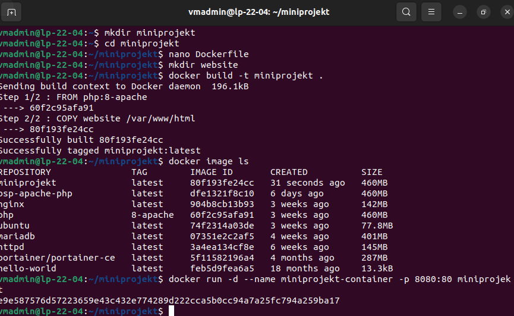

# Miniprojekt M347

# Inhalt
1. [Info](#info)
2. [Aufgabenstellung](#aufgabenstellung)
3. [Schritte](#schritte)
4. [Skript](#skript)

# Info
Autoren: Larissa Skala, Deen Altherr\
Erstelldatum: 23.03.2023\
Zuletzt geändert: 23.03.2023

# Aufgabenstellung
Erstellen Sie ein eigenes Webserver-Image auf Basis eines geeigneten Images (z.B. node.js express, apache, nginx, php, ..) und lassen Sie darin eine einfache (statische) Webseite laufen (Sie können zum Beispiel die Webseite aus Modul 293 verwenden). Die Webseite soll Bestandteil des Images sein und auf dem Host im Browser unter Port 8080 erreichbar sein. Starten Sie den Container am Ende so, dass sich die Dateien zur Webseite (HTML, CSS, etc.) und die Logdateien in lokalen Verzeichnissen befinden, damit die Webseite von dort aus weiterentwickelt werden kann. Dokumentieren Sie Ihr Mini-Projekt auf Github/Gitlab sinnvoll (inkl. Dockerfile) und geben Sie die URL dazu der Lehrperson ab.
Quelle: Aufgabe 3.2-2 im GBS Gitlab

# Schritte
Ordner erstellen für das Image

    mkdir miniprojekt

Zum Ordner navigieren

    cd miniprojekt

Dockerfile erstellen

    nano Dockerfile

Folgenden Inhalt in das Dockerfile einfügen:

    FROM  php:8-apache  COPY  website  /var/www/html
Ordner für die Webseite erstellen

    mkdir website
Dann können die gewünschten Dokumente eingefügt werden. Beispielsweise durch:

    cd website
    nano exampledocument.html
    cd ..
Container starten

    docker run -d --name miniprojekt-container -p 8080:80 miniprojekt
Nun läuft die Webseite und kann über localhost angeschaut werden.

# Skript 

